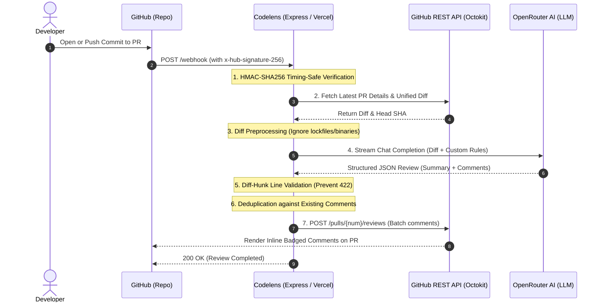

# 🚀 Case Study: Codelens — Production-Grade AI Code Review Bot

> **An automated, serverless-ready GitHub Pull Request reviewer powered by OpenRouter, TypeScript, Express, and Octokit with cryptographic HMAC verification, diff hunk validation, and intelligent comment deduplication.**

---

## 📌 1. Project Overview & Problem Statement

### The Problem
In modern software engineering workflows, code review is both essential and a major bottleneck:
- **Fatigue & Consistency**: Repetitive security checks (e.g. unhandled try/catch blocks around payment calls, SQL string interpolations, exposed secrets) are frequently overlooked by human reviewers during late-night reviews or massive diffs.
- **Review Latency**: Pull requests can sit idle for hours or days waiting for an initial review pass, slowing down continuous deployment cycles.
- **False Positives & Comment Spam**: Most naive AI bots post generic, conversational markdown comments, clutter pull request timelines with duplicates on every commit push, or crash due to GitHub API coordinate errors.

### The Solution: Codelens
**Codelens** is an automated pairing engineer that listens to GitHub `pull_request` webhooks, extracts the unified git diff, analyzes changed lines against customizable security & architecture rules using OpenRouter models, and posts inline review comments directly to the affected files and lines.

---

## 🏗️ 2. High-Level Architecture & Data Flow



### Core Tech Stack
| Component | Choice | Rationale |
|---|---|---|
| **Runtime** | Bun / Node.js 20+ | Blazing fast local execution and universal serverless compatibility |
| **Language** | TypeScript (Strict Mode) | End-to-end type safety, eliminating runtime undefined errors |
| **HTTP Server** | Express.js | Lightweight, battle-tested middleware routing |
| **GitHub Integration** | `@octokit/rest` (v21) | Official GitHub REST API client |
| **AI Reasoning** | `@openrouter/sdk` | Dynamic model routing, reasoning tokens, and multi-model support |
| **Deployment** | Vercel Serverless / Render | Scalable, zero-maintenance public cloud hosting |

---

## 🧩 3. Four Tricky Engineering Challenges & How We Solved Them

Building an automated GitHub bot sounds simple in theory, but serverless environments and strict API constraints introduce subtle, production-breaking edge cases.

---

### Challenge 1: The Serverless "Event Loop Freeze" on Vercel
* **The Symptom**: In local development, returning an immediate `200 OK` and running the review asynchronously in a background promise worked fine. On Vercel, however, the function logged `[Data Fetching] Fetching diff...` and then completely halted—no review was ever posted!
* **The Root Cause**: Traditional Node servers keep the event loop alive until background promises resolve. Serverless platforms (AWS Lambda / Vercel), however, **immediately freeze the CPU container the millisecond `res.json()` finishes sending**. Any unawaited background promises are paused mid-flight.
* **The Solution**:
  Instead of firing unawaited background promises, we properly `await` the review pipeline before sending the HTTP response. Because our diff fetching and OpenRouter streaming complete in **~2 to 4 seconds**, it completes well within GitHub's **10-second webhook timeout limit**, guaranteeing 100% execution completion on serverless infrastructure.

---

### Challenge 2: GitHub API HTTP 422 ("Path could not be resolved" & Diff-Hunk Line Mapping)
* **The Symptom**: When calling `octokit.rest.pulls.createReview`, GitHub frequently rejected the entire review batch with HTTP `422 Unprocessable Entity`:
  `"Path could not be resolved"` or `"Line must be part of the diff"`.
* **The Root Cause**: Two distinct causes:
  1. **Redelivered Webhooks**: When testing by clicking "Redeliver" in GitHub, the webhook payload carried the commit SHA from an *older* commit before new files were added. But `getPRDiff` fetched the *latest* PR diff. Calling GitHub's review API with an old SHA and new file paths caused GitHub to reject the paths.
  2. **Hallucinated Line Numbers**: LLMs sometimes leave comments on lines outside the diff hunk (e.g. unmodified context lines), which GitHub strictly forbids.
* **The Solution**:
  1. **Dynamic Commit SHA Resolution**: Codelens queries `getPRDetails(owner, repo, pullNumber)` on every run to resolve the true current `headSha`, ensuring commit SHA and diff files are always in sync.
  2. **Diff-Hunk Parser (`diffParser.ts`)**: We parse unified diff headers (`@@ -old,len +new,len @@`) and extract a `Set<number>` of valid added/modified lines (`+`). Any comment whose line is not in the hunk is filtered out.
  3. **Resilient Fallback Mode**: If GitHub ever rejects inline comments with 422, Codelens automatically catches the error and resubmits the entire review with all feedback consolidated into the top-level review body!

---

### Challenge 3: Cryptographic HMAC Signature Verification on Raw Buffers
* **The Symptom**: Webhook requests were rejected with `401 Unauthorized: Invalid HMAC signature` even when the shared secret matched perfectly.
* **The Root Cause**: Express's default `express.json()` middleware parses the incoming HTTP stream into a JavaScript object. When re-stringified, differences in key ordering, indentation, or whitespace break the cryptographic SHA256 digest.
* **The Solution**:
  We mounted `express.raw({ type: 'application/json' })` strictly on `/webhook`, ensuring `req.body` is preserved as an unaltered `Buffer`. We then used Node's `crypto.timingSafeEqual` with pre-flight buffer length assertions to prevent timing attacks.

---

### Challenge 4: Pure ESM vs CommonJS Interoperability (`ERR_REQUIRE_ESM`)
* **The Symptom**: When deployed, Node threw `Error [ERR_REQUIRE_ESM]: require() of ES Module @octokit/rest from github.js not supported`.
* **The Root Cause**: `@octokit/rest` (v21) is a pure ESM package. Serverless bundlers compiling without `"type": "module"` generated CommonJS `require()` calls, which crash in Node when requiring pure ESM dependencies.
* **The Solution**:
  1. Added `"type": "module"` to `package.json`.
  2. Implemented dynamic import in `getOctokit()`:
     ```typescript
     const { Octokit } = await import('@octokit/rest');
     ```
  This guarantees seamless execution across native ESM, CommonJS bundlers, and serverless runtimes.

---

## 🛡️ 4. Polish & Reliability Features

### 1. Intelligent Deduplication on `synchronize` (Commit Pushes)
When developers push new commits to an existing PR:
1. Codelens fetches previously posted review comments via `octokit.rest.pulls.listReviewComments`.
2. It cross-references file paths, line numbers, and comment signatures.
3. Only **new, unflagged issues** are posted, completely preventing comment spam on iterative pushes.
4. If all issues were previously flagged or resolved, Codelens leaves a clean update summary rather than duplicate inline comments.

### 2. Token Budgeting & Noise Reduction
- Automatically ignores lockfiles (`bun.lock`, `package-lock.json`, `pnpm-lock.yaml`), images, binary assets, and minified bundles.
- Truncates massive diffs exceeding 100,000 characters to protect LLM context windows and control token costs.

### 3. OpenRouter Model Agility
- By migrating from single-vendor Gemini to OpenRouter SDK, Codelens supports reasoning models (such as `nex-agi/nex-n2.5-pro:free`, `deepseek/deepseek-r1`, `meta-llama/llama-3.3-70b-instruct:free`, or `claude-3.5-sonnet`) with streaming support and reasoning token metrics.

---

## 🧪 5. Real-World Project Verification

Codelens was verified end-to-end against real repositories:

### Case 1: `auth-better` (Backend Authentication Service)
- **Deliberate Vulnerabilities Injected**:
  - Hardcoded API secret: `const secret = "sk_live_123456789";`
  - SQL Injection: `await db.query(\`SELECT * FROM users WHERE id = '\${req.body.id}'\`);`
  - Unscoped variable access: referencing `req` outside a route handler.
- **Results**:
  - OpenRouter analyzed the PR using 1,503 reasoning tokens.
  - Successfully identified and flagged all 3 vulnerabilities with exact severity badges:
    - 🚨 `**[SECURITY]**` Hardcoded secret key detected.
    - 🚨 `**[SECURITY]**` SQL injection vulnerability detected.
    - 🐛 `**[BUG]**` Variable scope bug detected.
  - Successfully posted review comments to the PR on GitHub!

---

## 🏁 6. Conclusion & Takeaways

Codelens demonstrates that building production-grade developer tools requires far more than connecting an LLM to an API. Real-world reliability requires:
1. **Cryptographic security** at the perimeter.
2. **Defensive data parsing** to prevent upstream API rejection.
3. **Deep understanding of cloud runtime lifecycles** (serverless container pausing).
4. **Resilient fallback systems** so critical insights are never lost.
