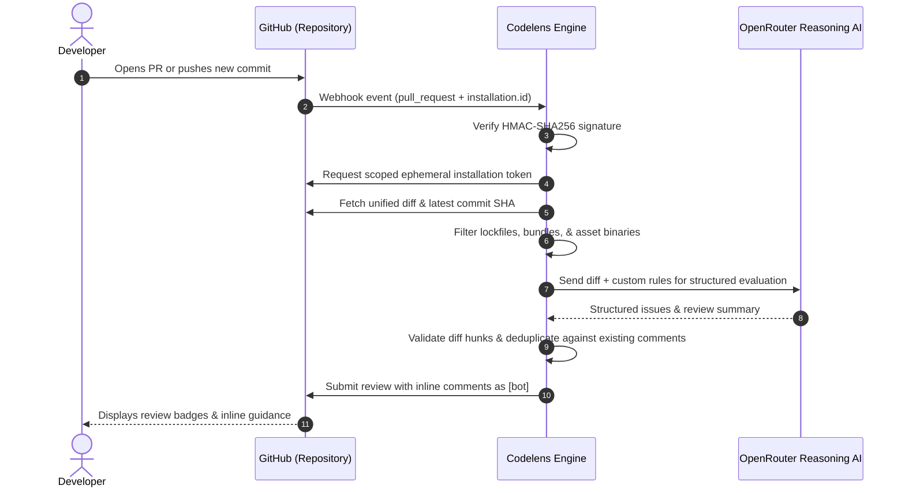

# 🔍 Codelens — AI-Powered Pull Request Code Reviewer

[-181717.svg?logo=github)]()

> **Codelens** is an autonomous, AI-powered GitHub App that delivers automated code reviews across your repositories in seconds. Powered by frontier reasoning models via OpenRouter, Codelens acts as an always-on senior staff engineer—intercepting pull requests in real time, detecting critical security vulnerabilities, catching hidden runtime bugs, and posting precise inline feedback directly on your modified code lines.

---

## 📑 Table of Contents

- [Overview](#-overview)
- [Key Capabilities](#-key-capabilities)
- [How Codelens Works](#-how-codelens-works)
- [Quick Start: 1-Click Installation](#-quick-start-1-click-installation)
- [Review Anatomy & Severity Badges](#-review-anatomy--severity-badges)
- [Custom Engineering Rules Engine](#-custom-engineering-rules-engine)
- [Smart Noise Reduction & Token Budgeting](#-smart-noise-reduction--token-budgeting)
- [Re-Review & Deduplication Engine](#-re-review--deduplication-engine)
- [Reliability & Self-Healing Architecture](#-reliability--self-healing-architecture)
- [Security, Permissions & Privacy](#-security-permissions--privacy)
- [Managing & Uninstalling](#-managing--uninstalling)
- [Frequently Asked Questions (FAQ)](#-frequently-asked-questions-faq)

---

## 🌟 Overview

Code reviews are crucial for shipping reliable software, but engineering teams routinely face review bottlenecks, fatigue, and missed vulnerabilities. High-risk bugs—such as SQL string concatenation, leaked credentials, unhandled async exceptions, or unvalidated payment flows—frequently slip past manual checks.

**Codelens** automates the initial review pass with zero friction. Operating as a native **GitHub App**, it automatically triggers on every pull request, analyzes changes through advanced AI reasoning models, and leaves constructive inline suggestions directly in the GitHub **Files changed** view under its official bot profile.

---

## ⚡ Key Capabilities

- **1-Click Zero-Config Onboarding**: Connect any repository in seconds. No webhook setup, no API key required from developers, and zero repository code changes.
- **Deep Semantic Reasoning**: Leverages high-parameter reasoning models via OpenRouter to trace variable lifecycles, execution flows, and cross-file dependencies rather than simple regex patterns.
- **Pinpoint Inline Reviews**: Comments are placed directly on the exact lines modified in the pull request with clear explanations and suggested fixes.
- **Executive Review Summaries**: Delivers a top-level summary outlining the pull request's overall risk profile, total issues found, and architectural health.
- **Zero Comment Spam (Smart Deduplication)**: When developers push subsequent commits (`synchronize` events), Codelens automatically detects existing comments and skips previously reported issues.
- **Self-Healing Review Engine**: Automatically detects and cleans up orphaned draft/pending reviews, guaranteeing uninterrupted continuous review workflows.
- **Intelligent Noise Filtering**: Strips lockfiles, compiled binaries, minified bundles, and images so reviews remain laser-focused on reviewable application logic.
- **Resilience Fallback**: If upstream line coordinates cannot be placed inline, Codelens automatically consolidates all findings into a structured review body so warnings are never lost.

---

## 🔄 How Codelens Works

---

## 🚀 Quick Start: 1-Click Installation

Installing Codelens on your GitHub account or organization requires **zero technical configuration**:

### Step 1: Open the Installation Page
Visit the official GitHub App page:  
👉 **[Install Codelens on GitHub](https://github.com/apps/codelens-reviewer-sumon-chandra)**

### Step 2: Choose Your Account
Select whether you want to install Codelens on your personal account or an organization.

### Step 3: Select Repositories
- **All repositories**: Automatically reviews all current and future pull requests.
- **Only select repositories**: Choose specific repositories (e.g., your backend API or web app).

### Step 4: Authorize & Install
Click **Install & Authorize**. 

**You're all set!** The next time a pull request is opened or updated in your repository, Codelens will review it automatically.

---

## 🏷️ Review Anatomy & Severity Badges

Every comment posted by Codelens includes a distinct visual badge identifying its urgency and category:

### 1. 🚨 `[SECURITY]`
Critical vulnerabilities that expose systems to compromise or data leakage:
- Hardcoded API credentials, private secrets, or auth tokens.
- SQL injection vectors (string interpolation in database queries).
- Missing authentication/authorization checks or cross-site scripting (XSS) traps.

### 2. 🐛 `[BUG]`
Functional defects, runtime traps, and uncaught exceptions:
- Missing `try/catch` error boundaries around external APIs, payments, or database calls.
- Unhandled Promise rejections and missing `await` operators.
- Out-of-scope variable references, potential `null`/`undefined` dereferencing.

### 3. 🎨 `[STYLE]`
Maintainability, performance, and best practices:
- Dangerous type assertions (`as any`) bypassing TypeScript compile-time safety.
- Dead code, redundant operations, or inefficient data transformations.
- Deviation from idiomatic patterns and naming conventions.

### 4. 📋 `[CUSTOM RULE]`
Domain-specific engineering rules defined in the team's custom rule configuration.

---

## 📋 Custom Engineering Rules Engine

Codelens actively enforces architectural rules tailored to production standards:

1. **Transactional & Payment Safety**: All financial transactions and external payment gateway calls (e.g., Stripe) must be wrapped in isolated error handlers.
2. **Database Query Hygiene**: Strict enforcement of parameterized queries and ORM query builders; direct raw SQL string concatenation is blocked.
3. **Secret Hygiene**: Zero-tolerance detection of private keys, webhook secrets, and test tokens in source code.
4. **Asynchronous Safety**: Ensuring every asynchronous operation is properly awaited and guarded against unhandled rejections.
5. **Strict TypeScript Standards**: Flagging unchecked `any` casts and loose type coercions.
6. **Input Boundary Validation**: Verifying that external user payloads and webhook request bodies are validated before processing.

---

## 🧹 Smart Noise Reduction & Token Budgeting

To guarantee fast turnaround times and eliminate noisy feedback, Codelens includes built-in diff preprocessing:

### Ignored Files
The following files are automatically filtered before reaching the AI model:
- **Lockfiles**: `package-lock.json`, `yarn.lock`, `pnpm-lock.yaml`, `bun.lock`, `bun.lockb`.
- **Media & Binaries**: `.png`, `.jpg`, `.svg`, `.ico`, `.woff2`, `.ttf`, `.pdf`.
- **Compiled Bundles**: Minified scripts (`.min.js`), stylesheets (`.min.css`), `.map` files.
- **Build Artifacts**: Output directories such as `dist/`, `build/`, `.next/`, or coverage reports.

### Diff Truncation Protection
For massive pull requests exceeding **100,000 characters**, Codelens truncates the payload safely with an explanatory note to maintain high reasoning performance and avoid context overflow.

---

## 🔁 Re-Review & Deduplication Engine

Codelens is built for real-world, iterative development cycles:

- **Initial Review (`opened`)**: Analyzes all modified code, posts inline comments on detected flaws, and generates an executive summary.
- **Incremental Commits (`synchronize`)**:
  - Automatically queries the GitHub API for existing review comments on the pull request.
  - Matches paths and line numbers to **skip already reported issues**.
  - Posts inline alerts exclusively for *newly introduced issues*.
  - If all existing issues have been previously noted and no new bugs were added, Codelens leaves a clean update:
    > *🔄 Re-review Update: All detected issues on modified files were previously flagged. No new issues were introduced in this push.*
- **Clean PR Commits**: When code passes with zero issues, Codelens provides a positive approval confirmation to keep developer momentum fast.

---

## 🛡️ Reliability & Self-Healing Architecture

Codelens is engineered with defensive guardrails for enterprise reliability:

1. **Pending Review Conflict Auto-Healing**:
   - If a draft or unsubmitted review is left open, GitHub normally blocks new review submissions with a `422 Unprocessable Entity` error.
   - Codelens automatically detects this condition, safely cleans up the stale pending review via the GitHub API, and seamlessly retries review submission.
2. **Diff-Hunk Boundary Validation**:
   - AI models occasionally generate comments on unchanged surrounding context lines.
   - Codelens parses unified diff hunks and validates that every comment maps to an actual added/modified line (`+`), preventing GitHub 422 line-placement errors.
3. **Resilience Fallback**:
   - If line placement is rejected due to rapid concurrent commits, Codelens activates its fallback mode—posting all feedback in a single comprehensive review comment so critical warnings are never missed.

---

## 🔒 Security, Permissions & Privacy

- **Ephemeral Scoped Access Tokens**: As a GitHub App, Codelens never uses static long-lived personal access tokens. It signs temporary, short-lived installation access tokens on-demand via asymmetric cryptographic keys (`RSA SHA-256`).
- **Cryptographic Webhook Verification**: All incoming GitHub webhook payloads are validated using timing-safe HMAC-SHA256 signatures (`crypto.timingSafeEqual`). Unauthenticated requests are rejected immediately.
- **In-Memory Ephemeral Execution**: Repository code is read strictly in memory during the review pass. Code is never stored in persistent databases or used for model training.
- **Minimal Required Permissions**:
  - **Pull requests**: `Read & Write` (to inspect diffs and post review comments).
  - **Contents**: `Read-only` (to inspect commit history).
  - **Metadata**: `Read-only` (mandatory GitHub default).

---

## ⚙️ Managing & Uninstalling

You maintain full control over where Codelens is installed:

1. In GitHub, go to your **Settings** -> **Applications** -> **Installed GitHub Apps**.
2. Click **Configure** next to **Codelens-Reviewer**.
3. From this screen, you can:
   - Add or remove specific repositories.
   - Temporarily suspend the app.
   - Click **Uninstall** to permanently remove Codelens from your account or organization.

---

## ❓ Frequently Asked Questions (FAQ)

#### Q: Do I need an OpenAI, Gemini, or OpenRouter API key to use Codelens?
**A**: No. When using the hosted Codelens GitHub App, all AI processing is handled by the platform backend. End users only need to install the GitHub App.

#### Q: Does Codelens support private repositories?
**A**: Yes. Codelens works seamlessly with both public and private repositories under your GitHub account or organization.

#### Q: Will Codelens post duplicate comments if I push multiple commits?
**A**: No. Codelens cross-references previously posted comments on every push and automatically skips duplicates to prevent comment spam.

#### Q: How fast does Codelens review a Pull Request?
**A**: Most pull requests are reviewed within **5 to 15 seconds** from the moment the PR is opened or updated.

---

## 📄 License & Terms

© Codelens. Distributed for proprietary enterprise and personal developer use.
